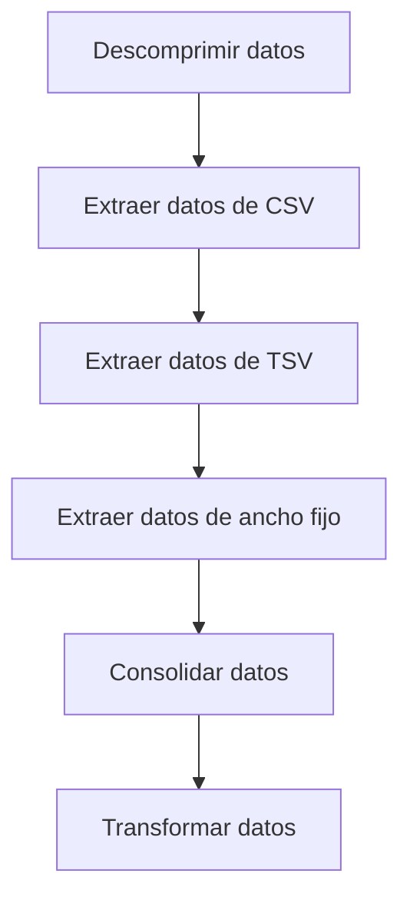
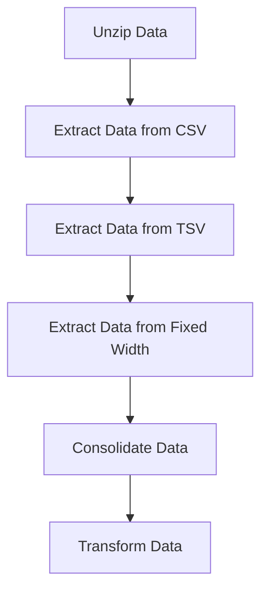

# ETL con Apache Airflow

Este proyecto implementa un proceso ETL (Extract, Transform, Load) utilizando **Apache Airflow**. El flujo de trabajo (DAG) extrae datos de diferentes fuentes, los transforma y los consolida en un solo archivo.

## 📌 Descripción

El DAG `ETL_toll_data` realiza las siguientes tareas:

1. **Descomprime los archivos fuente** (`tolldata.tgz`).
2. **Extrae datos** de archivos con diferentes formatos:
   - CSV (`vehicle-data.csv`)
   - TSV (`tollplaza-data.tsv`)
   - Ancho fijo (`payment-data.txt`)
3. **Consolida los datos** en un solo archivo.
4. **Transforma los datos** modificando la cuarta columna a mayúsculas.

## 🚀 Flujo de trabajo (DAG)



## 🛠️ Tareas del DAG

### 1️⃣ Descomprimir archivos
```bash
tar -xzf /home/project/airflow/dags/finalassignment/tolldata.tgz -C /home/project/airflow/dags/finalassignment
```

### 2️⃣ Extraer datos de CSV
```bash
cut -d "," -f1-4 /home/project/airflow/dags/finalassignment/vehicle-data.csv > /home/project/airflow/dags/finalassignment/csv_data.csv
```

### 3️⃣ Extraer datos de TSV
```bash
cut -f5-7 /home/project/airflow/dags/finalassignment/tollplaza-data.tsv | tr "\t" "," > /home/project/airflow/dags/finalassignment/tsv_data.csv
```

### 4️⃣ Extraer datos de ancho fijo
```bash
cut -c 59- /home/project/airflow/dags/finalassignment/payment-data.txt | tr " " "," > /home/project/airflow/dags/finalassignment/fixed_width_data.csv
```

### 5️⃣ Consolidar datos
```bash
paste -d "," /home/project/airflow/dags/finalassignment/csv_data.csv \
    /home/project/airflow/dags/finalassignment/tsv_data.csv \
    /home/project/airflow/dags/finalassignment/fixed_width_data.csv \
    > /home/project/airflow/dags/finalassignment/extracted_data.csv
```

### 6️⃣ Transformar datos
```bash
sed 's/[^,]*/\U&/4' /home/project/airflow/dags/finalassignment/extracted_data.csv > /home/project/airflow/dags/finalassignment/transformed_data.csv
```
#### Agradecimientos
Este proyecto fue inspirado por el curso "Data Engineering" de IBM en Coursera. Los conceptos y técnicas utilizados en este script fueron aprendidos a través de este curso.

---

# ETL with Apache Airflow

This project implements an ETL (Extract, Transform, Load) process using **Apache Airflow**. The workflow (DAG) extracts data from different sources, transforms it, and consolidates it into a single file.

## 📌 Description

The DAG `ETL_toll_data` performs the following tasks:

1. **Unzips the source files** (`tolldata.tgz`).
2. **Extracts data** from files with different formats:
   - CSV (`vehicle-data.csv`)
   - TSV (`tollplaza-data.tsv`)
   - Fixed Width (`payment-data.txt`)
3. **Consolidates the data** into a single file.
4. **Transforms the data** by modifying the fourth column to uppercase.

## 🚀 Workflow (DAG)



## 🛠️ DAG Tasks

### 1️⃣ Unzip files
```bash
tar -xzf /home/project/airflow/dags/finalassignment/tolldata.tgz -C /home/project/airflow/dags/finalassignment
```

### 2️⃣ Extract data from CSV
```bash
cut -d "," -f1-4 /home/project/airflow/dags/finalassignment/vehicle-data.csv > /home/project/airflow/dags/finalassignment/csv_data.csv
```

### 3️⃣ Extract data from TSV
```bash
cut -f5-7 /home/project/airflow/dags/finalassignment/tollplaza-data.tsv | tr "\t" "," > /home/project/airflow/dags/finalassignment/tsv_data.csv
```

### 4️⃣ Extract data from Fixed Width
```bash
cut -c 59- /home/project/airflow/dags/finalassignment/payment-data.txt | tr " " "," > /home/project/airflow/dags/finalassignment/fixed_width_data.csv
```

### 5️⃣ Consolidate data
```bash
paste -d "," /home/project/airflow/dags/finalassignment/csv_data.csv \
    /home/project/airflow/dags/finalassignment/tsv_data.csv \
    /home/project/airflow/dags/finalassignment/fixed_width_data.csv \
    > /home/project/airflow/dags/finalassignment/extracted_data.csv
```

### 6️⃣ Transform data
```bash
sed 's/[^,]*/\U&/4' /home/project/airflow/dags/finalassignment/extracted_data.csv > /home/project/airflow/dags/finalassignment/transformed_data.csv
```
#### Acknowledgments
This project was inspired by the "Data Engineering" course by IBM on Coursera. The concepts and techniques used in this script were learned through this course.
